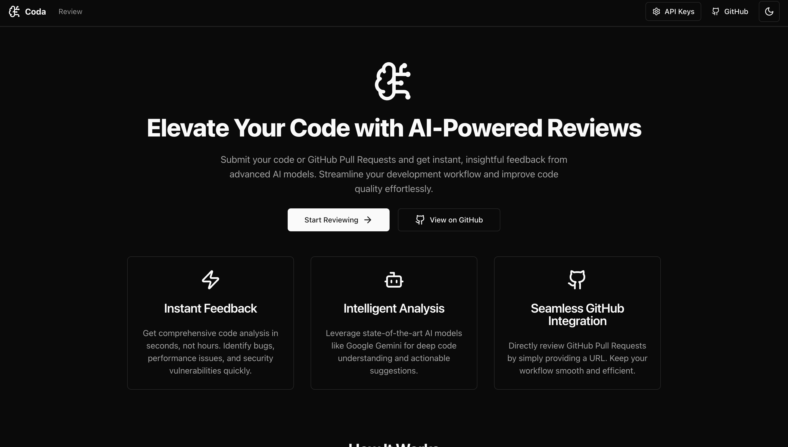

# Coda: AI-Powered Code Review Assistant

Coda is a web application designed to help developers improve their code quality by leveraging the power of Generative AI. Users can submit code snippets, entire files, or GitHub Pull Request URLs for comprehensive review and receive actionable feedback from advanced AI models like Google Gemini. Or just chat with Coda on technical topics.

---

## Screenshots




---

## Key Features (Currently Implemented)

*   **AI Code Analysis:** Submit code (files or direct input) or GitHub PR URLs for review by AI.
*   **Multiple AI Models:** Choose from available Google Gemini models (e.g., Gemini 2.5 Flash, Gemini 2.5 Pro).
*   **File Uploads:** Upload multiple source code files for review with support for various programming languages.
    *   Max file size: 50MB per file.
    *   Max total upload size: 50MB.
    *   Supported file types include common script, web, and configuration files.
*   **GitHub PR Integration:**
    *   Fetch PR details (title, description, author, stats).
    *   Fetch and display diffs for changed files.
    *   Submit PR content for AI review.
*   **Interactive Chat Interface:**
    *   Communicate with the AI to ask questions, get clarifications, and discuss suggestions.
    *   Syntax highlighting for code blocks in messages and file previews.
*   **API Key Management:**
    *   Securely store Google Gemini API Key and GitHub Personal Access Token (PAT) in browser local storage.
    *   Dialog to easily update these credentials.
*   **User Interface:**
    *   Theme toggling (light, dark, system modes).
    *   Toast notifications for feedback on operations.
    *   Processing indicators during AI responses and PR fetching.
*   **Development Mode Debugging:** On-screen debug information for API key status, selected model, file counts, and errors.

## Planned Features & Future Improvements

We are continuously working to enhance Coda. Here are some of the plans and desired features:

### Core Functionality Enhancements:
*   **Persistent Chat History:** Implement robust chat history using IndexedDB or a similar client-side storage solution to save conversations locally.
*   **Expanded AI Provider Support:** Integrate more AI models and providers beyond Gemini using the Vercel AI SDK (e.g., OpenAI's GPT models, Anthropic's Claude).
*   **Enhanced Markdown Support:** Utilize `react-markdown` more extensively for richer message formatting in the chat, including tables, lists, and other markdown elements beyond code blocks.
*   **Improved GitHub PR Handling:**
    *   **PR "Fixing" Ability (Experimental):** Allow the AI to suggest concrete code changes for PRs and potentially create patch files or branch suggestions.
    *   **Conflict Resolution Assistance:** Explore ways the AI can help identify and suggest resolutions for merge conflicts (conceptual).
*   **AI Function Calling/Tools:** Equip the AI with tools to perform actions, such as:
    *   Searching within the uploaded codebase.
    *   Fetching specific documentation snippets.
    *   Running linters or static analysis tools (if feasible in the environment).
*   **Review Summaries:** For long reviews or multiple files, provide a concise summary of key findings.
*   **Export Review Results:** Allow users to export the AI's review comments in formats like Markdown or PDF.

### User Experience & Workflow:
*   **User Accounts & Cloud Sync:** Introduce user authentication to allow for saving review history and preferences across devices.
*   **More Granular Review Configuration:** Allow users to specify areas of focus for the review (e.g., security only, performance, documentation).
*   **Interactive Diff Viewer:** Enhance the display of PR diffs with more interactive features.
*   **Real-time Collaboration (Ambitious):** Allow multiple users to participate in a review session.
*   **VS Code Extension / IDE Integration:** Bring Coda's review capabilities directly into the developer's IDE.

### Technical & Performance:
*   **Advanced Error Handling:** Implement more specific and user-friendly error messages.

## Tech Stack

*   **Frontend:** Next.js, React, TypeScript, Tailwind CSS, Shadcn/UI
*   **AI Integration:** Vercel AI SDK
*   **State Management:** React Hooks (useState, useEffect, useReducer), potentially Zustand or Jotai for more complex global state.
*   **Styling:** Tailwind CSS, CSS Modules (as needed)
*   **Deployment:** Vercel (or similar Next.js hosting)

## Getting Started

1.  **Clone the repository:**
    ```bash
    git clone https://github.com/mzazakeith/Coda.git # Replace with your repo URL
    cd Coda
    ```

2.  **Install dependencies:**
    ```bash
    npm install
    # or
    yarn install
    # or
    pnpm install
    # or
    bun install
    ```
3.  **Run the development server:**
    ```bash
    npm run dev
    # or
    yarn dev
    # or
    pnpm dev
    ```
    Open [http://localhost:3000](http://localhost:3000) with your browser to see the result.

4.  **Configure API Keys in the UI:**
    Click on the "API Keys" or "Settings" button in the application header to enter your Google Gemini API Key (required for reviews) and optionally your GitHub Personal Access Token (PAT) for enhanced GitHub integration (e.g., accessing private PRs or higher rate limits).

## Contributing

Contributions are welcome! Please feel free to open an issue or submit a pull request.

---

*This README is a work in progress and will be updated as the project evolves.*